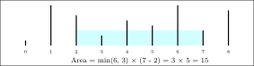

# Most Water

## 🧠 The Problem

You're given an array of non-negative integers, where each element represents
the height of a vertical line at that index. Your task is to choose two lines
such that together with the x-axis, they form a container that holds the most
water.

Note that, if forming our container, we ignore all barriers between the left
wall and the right wall.

Return the **maximum possible area** you can form by choosing any two lines.

## 🐢 Naive Solution: `mostWaterA`

Check all possible pairs of lines `(i, j)` using two nested loops. For each
pair, compute the area using the formula above and track the maximum seen.

- Time complexity: O(n²)
- Easy to implement, but very slow for large arrays

## 🐇 Two-Pointer Solution: `mostWaterB`

Use two pointers, `left` and `right`, starting at the two ends of the array. At
each step:

1. Compute the area between `heights[left]` and `heights[right]`
2. Update the max area if it's bigger
3. Move the pointer pointing to the **shorter** line inward:
   - If `heights[left] < heights[right]`, increment `left`
   - Otherwise, decrement `right`

Repeat until `left >= right`.

- Time complexity: O(n)
- This works because moving the taller line inward **cannot** increase the
  height, but moving the shorter line **might**
